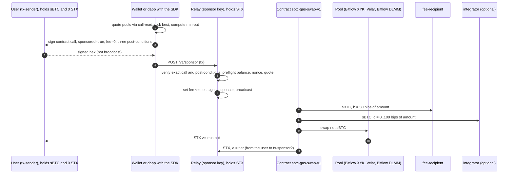

# sBTC to Stacks gas

A user who bridged BTC to sBTC holds an asset that cannot pay Stacks fees. This project lets that user swap sBTC to STX in one transaction whose network fee is paid by a sponsor, and the sponsor is repaid inside the same transaction. No subsidy, no eligibility server, no hardcoded sponsor: the contract pays whoever co-signed (`tx-sponsor?`), so any operator can run a relay and it funds itself from the first swap.

Status: contract deployed to mainnet on 2026-09-06 at block `8930825` ([record](contract.md#deployment)); relay live at `https://sbtc-gas-relay.labs2.workers.dev`; first sponsored swap mined at block `8932782` ([record](contract.md#tests-and-the-tx-sponsor-gap)); demo app and `sponsors.json` published at `https://stx.fan/zero_to/gas/`.

## How the money moves

Three fees, one transaction: **a** the rebate (`0.01`, `0.1`, or `1` STX, the user's choice, paid to the sponsor; the sponsor's margin is the tier minus the real fee), **b** the service fee (`50` bips of the sBTC input, in sBTC, immutable), **c** the integrator fee (`0` to `100` bips of the input, in sBTC, to the wallet or dapp that built the call).

## Deliverables

| Piece | What it is | Docs |
| --- | --- | --- |
| Contract | `sbtc-gas-swap-v1`, Clarity 3, immutable rate and pool whitelist | [contract.md](contract.md) |
| Relay | Verifies, preflights, co-signs, broadcasts. Cloudflare Worker or Docker. Anyone can run one | [relay.md](relay.md), [operator-guide.md](operator-guide.md) |
| SDK | `@no314/sbtc-gas-swap`: quote, build, submit; Leather and Bitflow adapters | [sdk.md](sdk.md), [leather-integration.md](leather-integration.md), [bitflow-integration.md](bitflow-integration.md) |
| Dapp | The reference flow "sBTC to Stacks gas", for testing and demos | [app/README.md](../app/README.md) |
| Relay directory | Known relays, read by the SDK | [sponsors.md](sponsors.md), [sponsors.json](sponsors.json) |

Research behind the design: [research-findings.md](research-findings.md), [decisions-log.md](decisions-log.md). Legal: [disclaimer.md](disclaimer.md).
